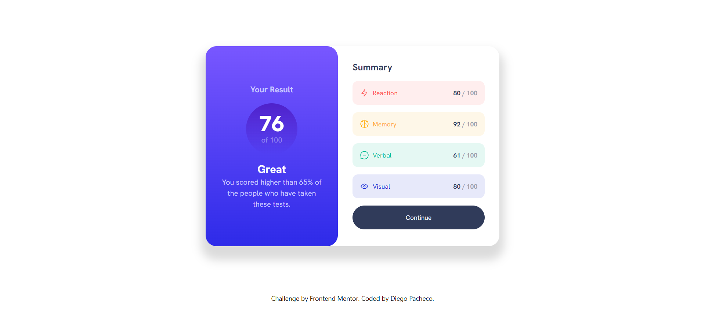

# Frontend Mentor - Results Summary Component Solution

This is a solution to the [Results summary component challenge on Frontend Mentor](https://www.frontendmentor.io/challenges/results-summary-component-CE_K6s0maV). Frontend Mentor challenges help you improve your coding skills by building realistic projects.

## Table of contents

- [Overview](#overview)
  - [The challenge](#the-challenge)
  - [Screenshot](#screenshot)
  - [Links](#links)
- [My process](#my-process)
  - [Built with](#built-with)
  - [What I learned](#what-i-learned)
  - [Continued development](#continued-development)
  - [Useful resources](#useful-resources)
- [Author](#author)

## Overview

### The challenge

Users should be able to:

- View the optimal layout for the interface depending on their device's screen size
- See hover and focus states for all interactive elements on the page

### Screenshot



### Links

- Solution URL: [GitHub Repository](https://github.com/Diego024/results-summary)
- Live Site URL: [Website](https://results-summary-chi.vercel.app/)

## My process

### Built with

- Semantic HTML5 markup
- CSS custom properties
- Flexbox
- CSS Grid
- Tailwind CSS
- Mobile-first workflow

### What I learned

While creating this project I was able to learned about the customization of Tailwind CSS, in order to be able to replicate the design provided.

```html
<script src="https://cdn.tailwindcss.com"></script>
<script src="./script.js"></script>
```

```js
tailwind.config = {
  theme: {
    extend: {
      fontFamily: {
        "hanken-grotesk": ["Hanken Grotesk", "sans-serif"],
      },
      colors: {
        "light-red": "hsl(0, 100%, 67%)",
        "orangey-yellow": "hsl(39, 100%, 56%)",
        "green-teal": "hsl(166, 100%, 37%)",
        "cobalt-blue": "hsl(234, 85%, 45%)",

        "light-slate-blue": "hsl(252, 100%, 67%)",
        "light-royal-blue": "hsl(241, 81%, 54%)",
        "violet-blue": "hsla(256, 72%, 46%, 1)",
        "persian-blue": "hsla(241, 72%, 46%, 0)",

        "pale-blue": "hsl(221, 100%, 96%)",
        "light-lavender": "hsl(241, 100%, 89%)",
        "dark-gray-blue": "hsl(224, 30%, 27%)",
      },
      spacing: {
        "38vh": "38vh",
        "57vh": "57vh",
        "90vh": "90vh",
        "10vh": "10vh",
      },
      screens: {
        desktop: "1440px",
      },
    },
  },
};
```

### Continued development

I want to keep practicing more my skills to create components with HTML and CSS, so I can improve on that, in order to make it easier when I start using some component oriented framework.

### Useful resources

- [Tailwind CSS Documentation](https://tailwindcss.com/docs/) - This helped me to learn about the customization of the framework and to get a better understanding of how to correctly use it.

## Author

- Website - [Diego Pacheco](https://github.com/Diego024/)
- Frontend Mentor - [@Diego024](https://www.frontendmentor.io/profile/Diego024)
